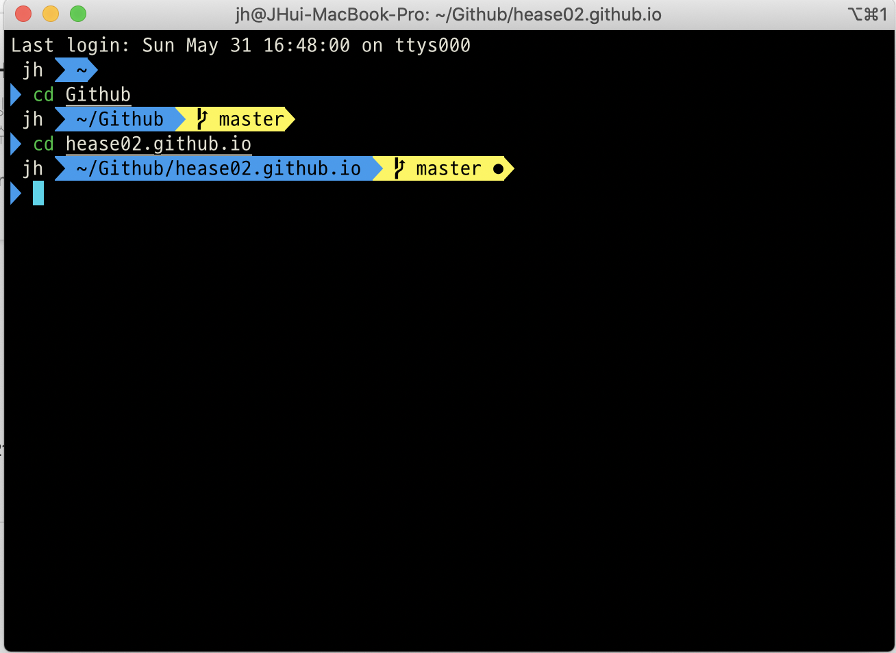

## Mac에서 Terminal 이쁘게 만들기

### iterm2 + oh-my-zsh  이용하기

4. MacBook-pro 없애기

~~~shell
prompt_context() {
  if [[ "$USER" != "$DEFAULT_USER" || -n "$SSH_CLIENT" ]]; then
    prompt_segment black default "%(!.%.)$USER"
  fi
}
~~~

~/.zshrc에서 위의 코드를 맨 마지막에 넣으면 사용자 이름만 나오게 할 수 있음. 

5. NewLine 적용

~~~shell
vi ~/.oh-my-zsh/themes/agnoster.zsh-theme
~~~

에서 

~~~shell
build_prompt() {
  RETVAL=$?
  prompt_status
  prompt_virtualenv
  prompt_context
  prompt_dir
  prompt_git
  prompt_bzr
  prompt_hg
  prompt_newline 
  prompt_end
}
~~~

build_prompt에서 prompt_newline을 prompt_end 위에 적용시킨다. 꼭 위에 적어야 한다고 한다. 

~~~shell
prompt_newline() {
  if [[ -n $CURRENT_BG ]]; then
    echo -n "%{%k%F{$CURRENT_BG}%}$SEGMENT_SEPARATOR
%{%k%F{blue}%}$SEGMENT_SEPARATOR"
  else
    echo -n "%"
  fi

  echo -n "%"
  CURRENT_BG=''
}
~~~

위의 코드를 아래에 추가해준다. 

6. Syntax-Hightlight 적용하기 

사용할 수 있는 명령어라면 초록색으로 하이라이팅 된다. 

~~~shell
//설치 
brew install zsh-syntax-highlighting

//플러그인 적용
echo "source /usr/local/share/zsh-syntax-highlighting/zsh-syntax-highlighting.zsh" >> ${ZDOTDIR:-$HOME}/.zshrc
~~~

### 완성작

---

