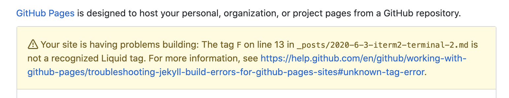

# Markdown 에러 처리

### Liqud Tag 오류 해결하기

  [Terminal 이쁘게 만들기](https://hease02.github.io/2020-05-31-iterm2-terminal/) 글을 올렸을 때 났던 에러이다.

 포스트의 13번 째 줄의 tag F에서 **Liquid tag** 에러가 났다는 경고문이 떴다. 

 

그런데 막상 편집기로 보면 13번째 줄에 F tag를 쓰지 않아서 오류를 찾기 힘들었다. 

 그래서 포스트에서 F를 쓴 곳이 있나 살펴보자 좀 더 밑에서 ``  로 감싸진 F를 찾을 수 있었다. 

  Jekyll은 Ruby 언어 기반이라 템플릿을 표현하기 위한 언어로 Liquid tag라는 것을 사용한다고 한다. 그래서 포스트에  `` 가 포함되어 있으면 jekyll이 텍스트로 처리하지 못하고 템플릿으로 읽어와서 생기는 오류이다.

 그러므로 텍스트로 인식하도록 만들어주면 된다. tag 오류가 나는 곳을 `` 와 ``  로 감싸주면 해결가능하다. 

